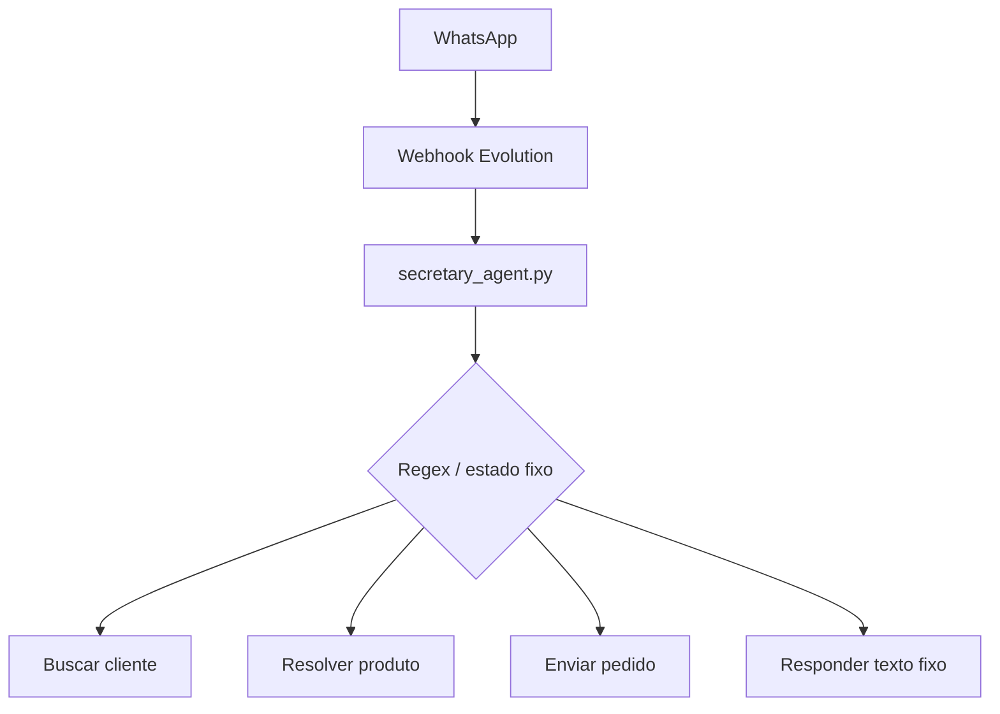
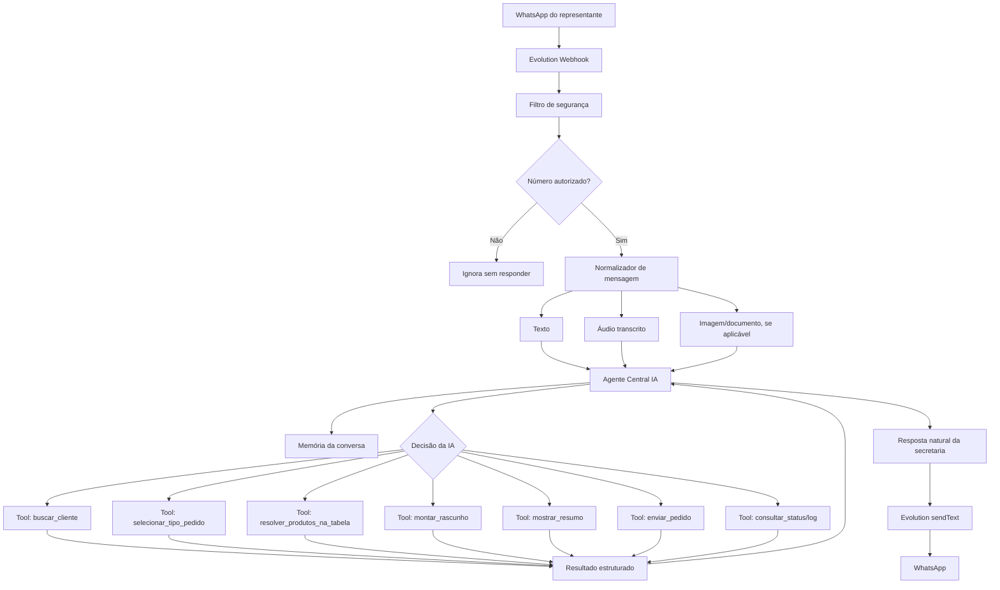
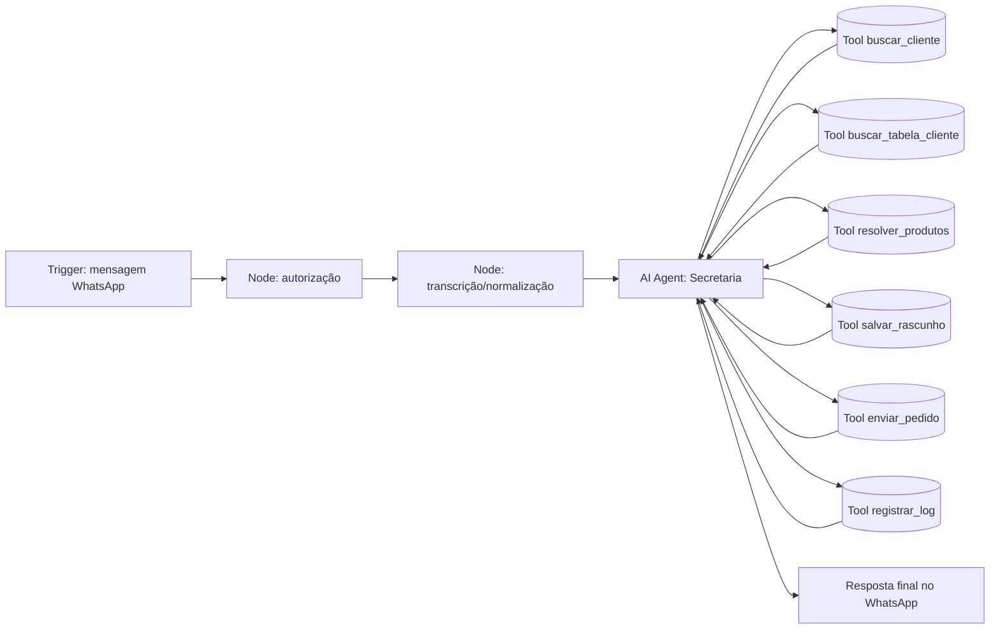
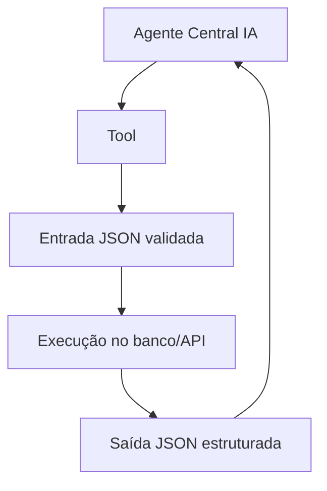
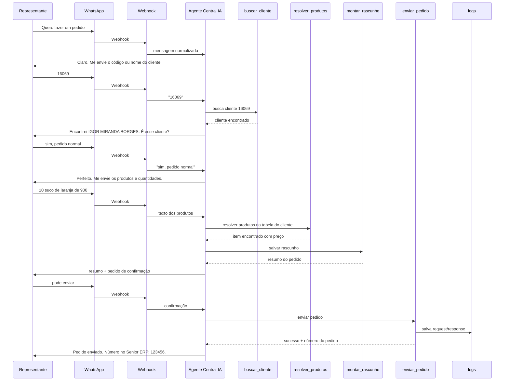
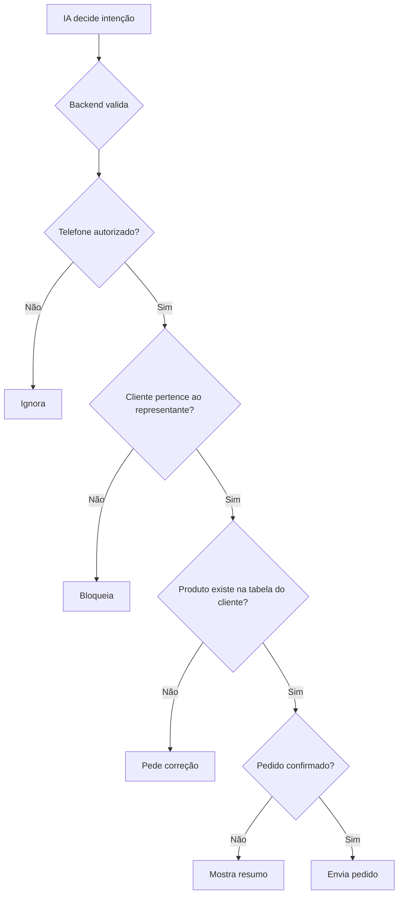
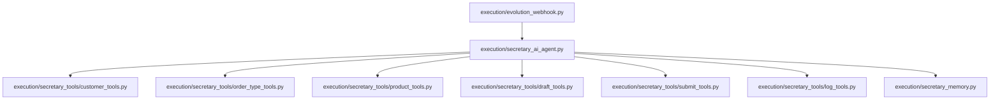
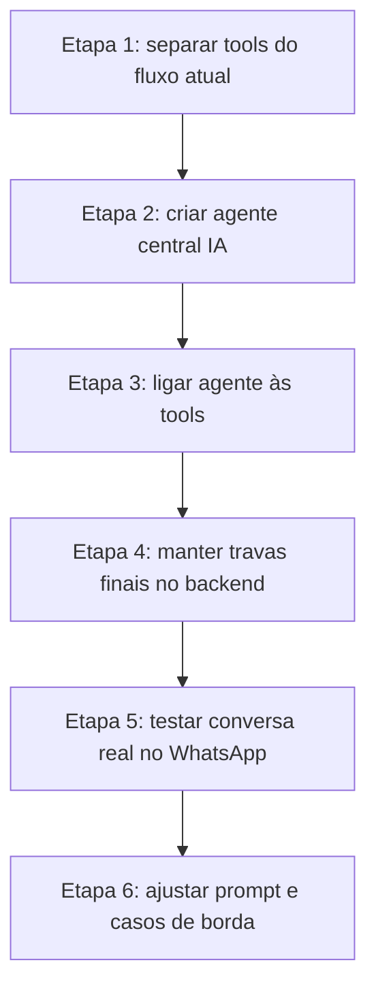
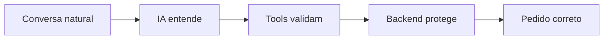

# Arquitetura Proposta: Secretaria IA para Pedidos Senior ERP

## Objetivo

Refatorar a secretaria para funcionar como uma agente central de IA, com conversa natural no WhatsApp, usando tools internas para executar tarefas específicas com validação forte.

A agente central conversa, entende intenção e decide o próximo passo. As tools não conversam diretamente com o representante; elas executam ações objetivas: buscar cliente, validar produto, montar pedido, enviar pedido e registrar logs.

## Problema Atual

Hoje o fluxo está muito preso a regras de backend:



Esse modelo quebra quando o representante fala de forma natural, por exemplo:

- "Pedido normal mesmo"
- "Ficou pedido normal?"
- "Nao quero mudar o cliente"
- "Me mostra o pedido de novo"
- "10 suco de laranja de 900"

O backend tenta encaixar a frase em regex e pode entender errado: produto, cliente, confirmação ou troca de cliente.

## Arquitetura Nova



## Desenho Mental no Estilo n8n



## Responsabilidade de Cada Camada

### 1. Webhook Evolution

Responsável só por receber e preparar a mensagem.

Faz:

- Identificar telefone real, inclusive quando vier `@lid`.
- Bloquear números não autorizados sem responder.
- Separar mensagem de texto, áudio, imagem ou outro tipo.
- Transcrever áudio quando necessário.
- Enviar a resposta final pelo WhatsApp.

Não faz:

- Decidir fluxo de pedido.
- Interpretar intenção comercial.
- Resolver produto.

### 2. Agente Central IA

É o cérebro da secretária.

Faz:

- Entender intenção da mensagem.
- Conversar de forma natural.
- Saber em qual etapa do pedido está.
- Decidir qual tool chamar.
- Pedir confirmação quando necessário.
- Explicar erro de forma humana.
- Não enviar pedido sem confirmação explícita.

Exemplos de intenção que a IA deve entender:

- `iniciar_pedido`
- `informar_cliente`
- `confirmar_cliente`
- `selecionar_tipo_pedido`
- `informar_produtos`
- `corrigir_produto`
- `manter_cliente`
- `trocar_cliente`
- `mostrar_resumo`
- `confirmar_envio`
- `cancelar_pedido`
- `consultar_pedidos`
- `conversa_geral`

### 3. Tools Internas

As tools recebem dados estruturados e devolvem dados estruturados.

Elas não improvisam conversa.



## Tools Necessárias

### buscar_cliente

Entrada:

```json
{
  "representante_documento": "34501704810",
  "busca": "16069"
}
```

Saída:

```json
{
  "encontrado": true,
  "cliente": {
    "codigo": "16069",
    "documento": "42423525818",
    "nome": "IGOR MIRANDA BORGES",
    "endereco": "RUA 11 DE AGOSTO - RIBEIRAO PRETO",
    "codigo_tabela": "205"
  }
}
```

### selecionar_tipo_pedido

Entrada:

```json
{
  "texto": "pedido normal mesmo"
}
```

Saída:

```json
{
  "tipo": "normal",
  "codigo_tipo_venda": "9010O"
}
```

Tipos:

| Tipo | Código |
|---|---|
| Pedido normal | `9010O` |
| Pedido PDV | `9010P` |
| Bonificação acordo comercial | `BONIF4` |

### resolver_produtos_na_tabela

Entrada:

```json
{
  "codigo_tabela": "205",
  "texto": "10 suco de laranja de 900"
}
```

Saída:

```json
{
  "encontrados": [
    {
      "codigo_produto": "SGRSSLAR",
      "nome": "SUCO GARRAFA PASTEURIZADO DE LARANJA",
      "variacao": "900",
      "quantidade": 10,
      "preco_unitario": 5.92,
      "subtotal": 59.2,
      "codigo_tabela_preco": "205"
    }
  ],
  "nao_encontrados": []
}
```

### montar_rascunho

Entrada:

```json
{
  "cliente_codigo": "16069",
  "representante_documento": "34501704810",
  "tipo_venda": "9010O",
  "itens": []
}
```

Saída:

```json
{
  "rascunho_id": "uuid",
  "status": "awaiting_confirmation",
  "resumo": "Cliente: IGOR MIRANDA BORGES..."
}
```

### enviar_pedido

Só pode ser chamada depois de confirmação do representante.

Entrada:

```json
{
  "rascunho_id": "uuid"
}
```

Saída:

```json
{
  "sucesso": true,
  "numero_pedido_senior": "123456",
  "request_log_id": "uuid",
  "response": {}
}
```

## Fluxo de Pedido



## Regras de Segurança que Continuam no Backend

Mesmo com IA central, algumas coisas não podem ficar soltas no modelo:



O backend continua sendo a trava final para:

- Número autorizado.
- Cliente da carteira do representante.
- Tabela de preço correta do cliente.
- Produto e variação existentes.
- Preço vindo da tabela oficial.
- Pedido só enviado após confirmação.
- Log completo da requisição e resposta.

## Como Fica a Conversa

### Antes

Representante:

> Pedido normal mesmo

Sistema:

> Pedido conferido:  
> Nao encontrados: Produto

### Depois

Representante:

> Pedido normal mesmo

Agente:

> Sim, ficou como pedido normal. Pode me enviar os produtos e quantidades.

### Antes

Representante:

> Não quero mudar o cliente. Quero suco de laranja de 900

Sistema:

> Entendi que talvez voce queira trocar o cliente...

### Depois

Agente:

> Certo, mantive o cliente atual. Vou conferir o suco de laranja 900 na tabela dele.

## Estrutura de Código Proposta



### Arquivos

| Arquivo | Função |
|---|---|
| `evolution_webhook.py` | Entrada e saída do WhatsApp |
| `secretary_ai_agent.py` | Agente central IA |
| `secretary_memory.py` | Estado e histórico resumido da conversa |
| `customer_tools.py` | Busca e validação de cliente |
| `order_type_tools.py` | Identificação de tipo de pedido |
| `product_tools.py` | Busca na tabela de preço do cliente |
| `draft_tools.py` | Montagem e atualização do rascunho |
| `submit_tools.py` | Envio do pedido para Senior ERP |
| `log_tools.py` | Logs de request/response |

## Prompt Base da Agente Central

Resumo do papel da agente:

```text
Você é a Secretaria de Pedidos da Sucos SPRES para representantes.
Converse de forma natural no WhatsApp.
Seu trabalho é ajudar o representante a montar pedidos.

Você pode conversar normalmente, mas para consultar dados reais use tools.
Nunca invente cliente, produto, preço, tabela ou número de pedido.
Nunca envie pedido sem confirmação clara do representante.
Se houver dúvida, pergunte de forma curta e objetiva.
```

## Plano de Refatoração



### Etapa 1

Extrair do `secretary_agent.py` as funções que já existem e transformar em tools internas.

### Etapa 2

Criar `secretary_ai_agent.py`, responsável por:

- Ler mensagem.
- Ler memória.
- Decidir intenção.
- Chamar tool.
- Escrever resposta natural.

### Etapa 3

Conectar tools com contrato JSON claro.

### Etapa 4

Manter validação determinística antes de qualquer envio.

### Etapa 5

Testar conversas reais:

- Saudação.
- Troca de tipo de pedido.
- Correção de produto.
- Manter cliente.
- Trocar cliente.
- Mostrar resumo.
- Confirmar envio.
- Cancelar pedido.

## Resultado Esperado

A secretária deixa de ser um fluxo rígido e passa a funcionar como:



Ou seja: a IA conduz a conversa, mas os dados críticos continuam sendo conferidos por código.
